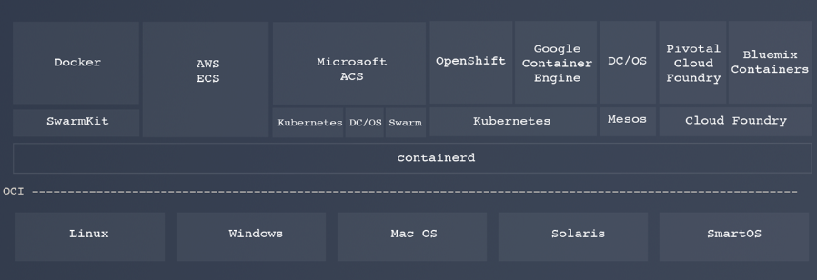
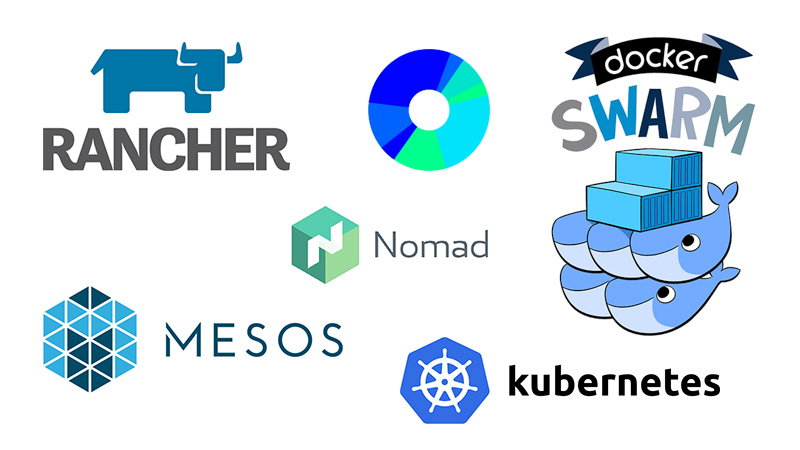
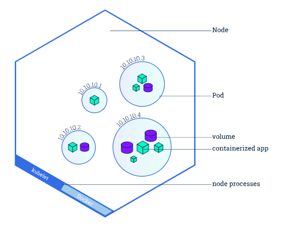
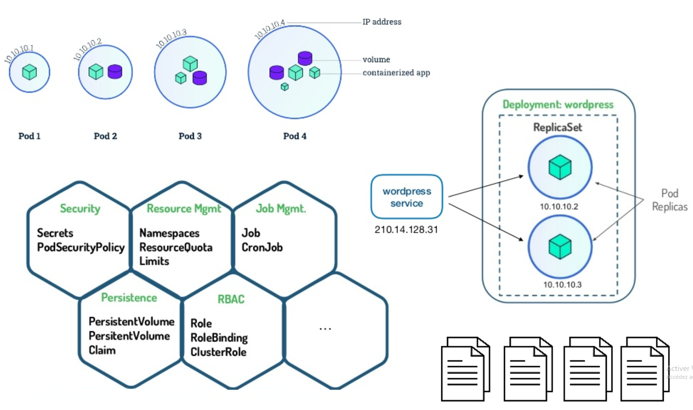
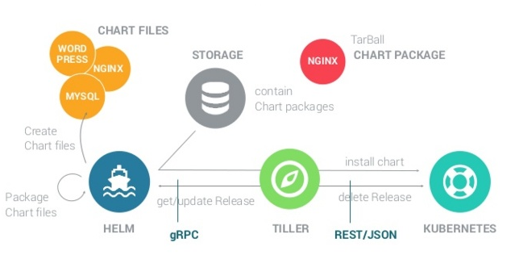

# Docker++

----

## Conteneurisation

-----

Un conteneur permet d'**isoler** chaque service : le serveur web, la base de données, une application peuvent être exécutés de façon indépendante dans leur conteneur dédié, contenant uniquement les dépendances nécessaires

-----


-----

The [Open Container Initiative (OCI)](https://www.opencontainers.org/)

* [runtime-spec](https://github.com/opencontainers/runtime-spec)
* [image-spec](https://github.com/opencontainers/image-spec)
* [distribution-spec](https://github.com/opencontainers/distribution-spec)

[`runc`](https://github.com/opencontainers/runc) est une CLI qui implémente ces spécifications et qui permet donc de piloter la ou les fonctions de conteneurisation de Linux

Il existe d'autres implémentations de ces spécifications comme par exemple [`runhcs`](https://github.com/Microsoft/hcsshim) pour Windows

Notes:
* https://blog.docker.com/2015/06/runc/ - "To build Docker we have re-used large quantities of plumbing: Linux, Go, lxc, aufs, lvm, iptables, virtualbox, vxlan, mesos, etcd, consul, ... [...]".

-----

`containerd` est **LE** runtime sur lequel se base aujourd'hui les "gestionnaires de conteneurs". Il était historiquement couplé à Docker mais est désormais un projet evoluant séparément



*Il pilote les diverses implémentations de `runc` et est piloté ...*

Notes:
* https://containerd.io/ - `containerd` is available as a daemon for Linux and Windows. It manages the complete container lifecycle of its host system, from image transfer and storage to container execution and supervision to low-level storage to network attachments and beyond.

----

## Docker engine

-----


*Du Docker engine à `runc`*

-----


*Docker engine*

-----

### `docker`

-----

Pull de l'image `nginx` depuis [Docker Hub](https://hub.docker.com) (**LE** *Docker Registry* public officiel)

```bash
docker pull nginx

docker images nginx
```

Un *Docker Registry* est un serveur hébergeant et distribuant des images Docker

-----

Instanciation de l'image `nginx`

```bash
docker run -d --name my-nginx -p 8080:80 nginx

docker ps # Affiche les conteneurs en vie

curl -L http://localhost:8080 # Welcome to nginx!

docker rm -f my-nginx # Supprime le conteneur my-nginx
```

-----

Construction d'une image dérivée depuis `nginx`

```bash
mkdir -p public/; echo 'Hello World' > public/index.html

cat > Dockerfile <<EOF
FROM nginx:1.15

COPY public /usr/share/nginx/html
EOF

docker build -t my-app .

docker run -d --name my-app -p 8080:80 my-app

curl -L http://localhost:8080 # Hello World

docker rm -f my-app
```

-----

Ajout d'un tag sur `my-app` et `push` de l'image

```bash
# On se connecte au Docker Registry my-registry:8080
docker login my-registry:8080 

# On créée un tag 1.0 qui pointe vers le latest actuel
docker tag my-app:latest my-app:1.0 
docker images my-app:1.0 # Bingo !

docker push my-app:1.0
docker push my-app:latest
```

-----

Suppression des images `nginx` et `my-app`

```bash
docker rmi my-app:1.0 my-app nginx:1.15 nginx
```

-----

### `docker-compose`

-----

`docker-compose` est un outil qui permet de décrire plusieurs conteneurs comme un ensemble de services inter-connectés

`docker-compose` propose des sous-commandes qui correspondent, à peu de chose prês, à ce que propose la commande `docker`

-----

La spécification, au format *YAML*, plus connue sous le nom de *compose file*

```yaml
version: "3"

services:
  app:
    image: my-tomcat:9.0
    ports:
      - "8080:8080"
    networks:
      - my-app
    depends_on:
      - db

  db:
    image: postgres:10.6
    networks:
      - my-app
    volumes:
        pgdata:/var/lib/postgresql/data postgres

networks:
  my-app:

volumes:
  pgdata:
```

-----

Par exemple avec [dockersamples/example-voting-app](https://github.com/dockersamples/example-voting-app/blob/master/docker-compose.yml)

```bash
git clone https://github.com/dockersamples/example-voting-app.git
cd example-voting-app/

docker-compose up -d # Hello
docker-compose stop && docker-compose rm -Rf # Bye
```

----

## Orchestration de conteneurs

-----

Plate-forme permettant d'automatiser le déploiement, la montée en charge et la mise en œuvre de conteneurs d'applications sur des clusters de serveurs

Notes:
* Features:
  * Resilience:
    * Infrastructure availability.
    * k8s availability.
    * Application availability.
  * Networking:
    * Network segmentation
  * Storage:
    * Persistant Volumes.
  * Security. e.g.: RBAC on k8s.
  * Quotas.
  * Secrets Management.
  * Container workload:
    * Stateless applications.
    * Stateful applications.
    * Batch jobs.
    * Daemons.
  * Run, expose, autoscale.
  * Maintenance.

-----



*Certains des orchestrateurs les plus connus sur le marché*

Notes:
* k8s is the leading tool in the industry.
  * It has more support from community.
  * Docker is currently pushing toward k8s.

-----

### Kubernetes (k8s)

-----


*Architecture de base*

Notes:
* Master
  * `kube-apiserver`
    * Component on the master that exposes the k8s API. It is the front-end for the k8s control plane.
  * `etcd`
    * Consistent and highly-available key value store used as k8s’ backing store for all cluster data.
  * `kube-scheduler`
    * Component on the master that watches newly created `Pods` that have no node assigned, and selects a node for them to run on.
  * `kube-controller-manager`
    * Component on the master that runs controllers.
    * Logically, each controller  is a separate process, but to reduce complexity, they are all compiled into a single binary and run in a single process.
    * These controllers include:
      * Node Controller: Responsible for noticing and responding when nodes go down.
      * Replication Controller: Responsible for maintaining the correct number of `Pods` for every replication controller object in the system.
      * Endpoints Controller: Populates the `Endpoints` object (that is, joins `Services` & `Pods`).
      * Service Account & Token Controllers: Create default accounts and API access tokens for new namespaces.
* Node
  * `kubelet`
    * An agent that runs on each node in the cluster. It makes sure that containers are running in a pod.
    * It takes a set of PodSpecs that are provided through various mechanisms and ensures that the containers described in those PodSpecs are running and healthy. It doesn’t manage containers which were not created by k8s.
  * `kube-proxy`
    * It enables the k8s service abstraction by maintaining network rules on the host and performing connection forwarding.
* Networking model
  * Flannel is a very simple overlay network that satisfies the Kubernetes requirements. Many people have reported success with Flannel and Kubernetes.

-----

L'objet le plus basique : le `Pod`



* Un groupe d'un ou plusieurs conteneurs avec stockage et réseau partagé
* Une spécification sur la manière d'exécuter les conteneurs
* Toujours co-localisé et co-planifié, et s’exécute dans un contexte partagé. Il modélise un "hôte logique" spécifique à l'application

-----




*D'autres objets à déclarer, monsieur ?*

-----

```bash
kubectl get nodes # Affiche les noeuds du cluster

# Affiche les services sur le namespace "default"
kubectl get svc
# Affiche la plupart des objets du namespace kube-system
kubectl get all --namespace kube-system 

# Déclaration d'objets sur le cluster
echo manifest.yml | kubectl apply -f -

# Affiche et suit les logs de mon pod
kubectl logs my-pod --namespace my-app -f
```

-----

`Namespace`

```yaml
apiVersion: v1
kind: Namespace
metadata:
  name: nginx-1
  labels:
    app: nginx-1

---
apiVersion: v1
kind: ResourceQuota
metadata:
  name: pods
  namespace: nginx-1
spec:
  hard:
    pods: 5
    # requests.cpu: "2"
    # requests.memory: 1Gi
    # limits.cpu: "2"
    # limits.memory: 2Gi
    # requests.nvidia.com/gpu: 4
```

-----

`Service` : les `Pods` sont mortels !

```yaml
apiVersion: v1
kind: Service
metadata:
  name: nginx-1
  namespace: nginx-1
  labels:
    app: nginx-1
spec:
  # type: ClusterIP
  ports:
    - port: 80
      protocol: TCP
  selector:
    app: nginx-1
```

* `ClusterIP` : attribue une IP interne au cluster dans le bloc CIDR dédiées aux `Services`
* `NodePort` : translation de port sur chaque noeud du cluster
* `LoadBalancer` : chez un Cloud Provider (*ELB* chez AWS par exemple)

Notes:
* A k8s `Service` is an abstraction which defines a logical set of `Pods` and a policy by which to access them - sometimes called a micro-service. The set of `Pods` targeted by a `Service` is (usually) determined by a `Label Selector`.
* If you set the `type` field to `NodePort`, the k8s master will allocate a port from a range specified by `--service-node-port-range` flag, and each Node will proxy that port (the same port number on every Node) into your `Service`.
* A `Service` could target something located outside of the cluster.

-----

`Ingress` : ce type d'objet est surveillé et géré par un *Ingress Controller*. Il pointe sur un `Service`

```yaml
apiVersion: extensions/v1beta1
kind: Ingress
metadata:
  name: nginx-1
  namespace: nginx-1
spec:
  rules:
    - host: nginx-1.default.weeble.tech
      http:
        paths:
          - path: /
            backend:
              serviceName: nginx-1
              servicePort: 80
```

**N.B** : [Traefik](https://traefik.io/), un reverse proxy, est un exemple d'*Ingress Controller*.

-----

Un `Deployment` va créé un ou plusieurs `Pod` en fonction du nombre de replica

```yaml
apiVersion: apps/v1
kind: Deployment
metadata:
  name: nginx-1
  namespace: nginx-1
spec:
  selector:
    matchLabels:
      app: nginx-1
  replicas: 1
  template:
    metadata:
      labels:
        app: nginx-1
    spec:
      containers:
        - name: nginx-1
          image: nginx
          resources:
            limits:
              cpu: 256m
              memory: 256Mi
            requests:
              cpu: 128m
              memory: 128Mi
          ports:
            - containerPort: 80
```

-----

Selecteurs

```bash
# Tous les objets de l'application nginx-1
kubectl get all --all-namespaces -l app=nginx-1

# Tous les noeuds de type master
kubectl get nodes -l kubernetes.io/role=master
```

-----

Scaling et suppression du `Namespace`

```bash
# 0 Pods
kubectl scale deployment nginx-1 --namespace nginx-1 --replicas=0
# 2 Pods
kubectl scale deployment nginx-1 --namespace nginx-1 --replicas=2
# 10 Pods ... euh 5 ?
kubectl scale deployment nginx-1 --namespace nginx-1 --replicas=10 

# Synthèse du Deployment 
kubectl describe deployment nginx-1 --namespace nginx-1
# Affiche le Deployment nginx-1 au format YAML
kubectl get deployment nginx-1 --namespace nginx-1 -o yaml

# Détruit ce Namespace et ce qu'il contient ...
## ... enfin presque ... les PersistentVolume restent
kubectl delete namespace nginx-1
```

-----

Tiens j'ai envie de détruire des `Namespaces` ou de supprimer mes `ResourceQuota` ...

*RBAC* (Role-Based Access Control) à la rescousse ; Impossible pour un des `Pods` de mon service CoreDNS de détruire des `Namespaces` :

```yaml
apiVersion: v1
kind: ServiceAccount
metadata:
  name: coredns
  namespace: kube-system

 ---
apiVersion: rbac.authorization.k8s.io/v1beta1
kind: ClusterRole
metadata:
  labels:
    kubernetes.io/bootstrapping: rbac-defaults
  name: system:coredns
rules:
  - apiGroups:
      - ""
    resources:
      - endpoints
      - services
      - pods
      - namespaces
    verbs:
      - list
      - watch

---
apiVersion: rbac.authorization.k8s.io/v1beta1
kind: ClusterRoleBinding
metadata:
  name: system:coredns
  annotations:
    rbac.authorization.kubernetes.io/autoupdate: true
  labels:
    kubernetes.io/bootstrapping: rbac-defaults
roleRef:
  apiGroup: rbac.authorization.k8s.io
  kind: ClusterRole
  name: system:coredns
subjects:
  - kind: ServiceAccount
    name: coredns
    namespace: kube-system

---
apiVersion: extensions/v1beta1
kind: Deployment
metadata:
  name: coredns
  namespace: kube-system
  labels:
    app: coredns
    kubernetes.io/cluster-service: "true"
    kubernetes.io/name: CoreDNS
spec:
# [...]
  template:
    spec:
      serviceAccountName: coredns
# [...]
```

-----

Maintenance du cluster

```bash
# Stop proprement les Pods du noeud k8s01
kubectl drain k8s01 

# Réautorise l'ordonnancement de ressources sur ce noeud
kubectl cordon k8s01
```

-----

*[...]*

D'autres objets ou concepts comme **par exemple** `StatefulSet` (adapté au déploiement d'applications statefull), `Endpoint` (route les `Services` et les `Pods`), `CronJob`, `DaemonSet`, `Job`, `ConfigMap` (stock de la configuration), `Secret`, `StorageClass`, `PersistentVolume`, `PersistentVolumeClaim`, les métriques, l'autoscaling (basé sur ces dernières), les rolling updates, le service mesh mériteraient le détour mais bon **ce n'est pas une formation ! :-)**

-----

Bon un petit dernier pour rassurer les amoureux du filtrage : `NetworkPolicy`

```yaml
kind: NetworkPolicy
apiVersion: networking.k8s.io/v1
metadata:
  namespace: default
  name: deny-from-other-namespaces
spec:
  podSelector:
    matchLabels:
  ingress:
    - from:
      - podSelector: {}
```


-----

# Helm


-----


*Helm est un gestionnaire de paquets pour k8s*

-----

* Un paquet est appelé `Charts`
  * Ce `Chart` est constitué d'objets k8s comme des `Déployment` ou des `Services`
  * Les descripteurs écrits en YAML sont générés via du Go(lang) templating
* Il devient une `Release` une fois déployé sur k8s par `helm`. La `Release` est forcément ... **versionné** !

Notes:
* Helm helps you manage k8s applications — Helm Charts helps you define, install, and upgrade even the most complex k8s application.
* Charts are easy to create, version, share, and publish — so start using Helm and stop the copy-and-paste.

-----



*Architecture*

-----

Deploiement du `Chart` Wordpress et suppression de sa `Release`

```bash
helm install stable/wordpress \
  --namespace wordpress \
  --name wordpress-1 \
  --set serviceType=ClusterIP \
  --set ingress.enabled=true \
  --set ingress.hosts[0].name=wordpress-1.default.weeble.tech

helm list --all wordpress-1 # Release n°1

curl -Lk https://wordpress-1.default.weeble.tech # Hello Wordpress!

helm delete --purge wordpress-1
# kubectl delete pvc data-wordpress-1-mariadb-0 --namespace wordpress
```

----

## Gitlab + Helm + k8s = CD

-----

Les *pull requests* (ou *merge requests*) permettent de proposer des modifications sur un remote Git

Ces dernières sont généralement discutées, corrigées et testées avant d'être mergées

-----

Des forges logicielles, comme [Gitlab](https://gitlab.com/), proposent ce mécanisme

-----

Certains workflows Git, comme [GitHub Flow](https://guides.github.com/introduction/flow/), s'appuient sur cette fonctionnalité

-----

Des exemples valent mieux qu'un long discours

* [Application pilote](https://gitlab.com/le-garff-yoann/mojochat)
* [Repository du `Chart` Helm de l'application pilote](https://gitlab.com/le-garff-yoann/helm-charts)

----

# Ressources

-----

## Docker

* [Documentation officielle](https://docs.docker.com/)
* [Docker Hub](https://hub.docker.com/)

-----

## k8s

* [Installation](https://kubernetes.io/docs/setup/)
* [Concepts](https://kubernetes.io/docs/concepts/)
* [RBAC](https://kubernetes.io/docs/reference/access-authn-authz/rbac/)
* [Liveness et Readiness](https://kubernetes.io/docs/tasks/configure-pod-container/configure-liveness-readiness-probes/)
* [Rolling update](https://kubernetes.io/docs/tutorials/kubernetes-basics/update/update-intro/)
* [Ressources](https://kubernetes.io/docs/concepts/configuration/manage-compute-resources-container/)
  * [Requests vs Limits](https://kubernetes.io/docs/concepts/policy/resource-quotas/#requests-vs-limits)
* [`PersistentVolume`](https://kubernetes.io/docs/concepts/storage/persistent-volumes/)
  * [kubernetes-incubator/external-storage](https://github.com/kubernetes-incubator/external-storage)
* [Isolation réseau - kubernetes-network-policy-recipes](https://github.com/ahmetb/kubernetes-network-policy-recipes)
* [Métriques](https://kubernetes.io/docs/tasks/debug-application-cluster/core-metrics-pipeline/)
* [Autoscaling](https://kubernetes.io/docs/tasks/run-application/horizontal-pod-autoscale/)
* [What is a Service Mesh?](https://www.redhat.com/fr/topics/microservices/what-is-a-service-mesh)
* [API overview](https://kubernetes.io/docs/reference/generated/kubernetes-api/v1.13/)
* [Bootcamp](https://kubernetesbootcamp.github.io/kubernetes-bootcamp)
* [50+ Useful Kubernetes Tools](https://dzone.com/articles/50-useful-kubernetes-tools)
* [SIGs (Special Interest Groups)](https://github.com/kubernetes-sigs)
* [Documentation Helm](https://docs.helm.sh/)
* [Repository Helm officiel](https://github.com/helm/charts)
* [kubespray](https://github.com/kubernetes-sigs/kubespray)
* [vagrant-k8s](https://gitlab.com/le-garff-yoann/vagrant-k8s)

-----

## Gitlab

* [Gitlab CI/CD](https://about.gitlab.com/product/continuous-integration/)

-----

## En vrac

* [YAML](https://yaml.org/)
* [Apprendre YAML en Y minutes](https://learnxinyminutes.com/docs/fr-fr/yaml-fr/)
* [Go(lang) templating](https://golang.org/pkg/text/template/#hdr-Text_and_spaces)
* [Git++](https://le-garff-yoann.gitlab.io/slides-gitplusplus)
